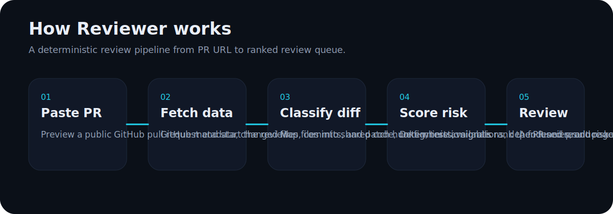
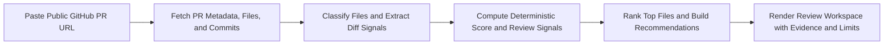
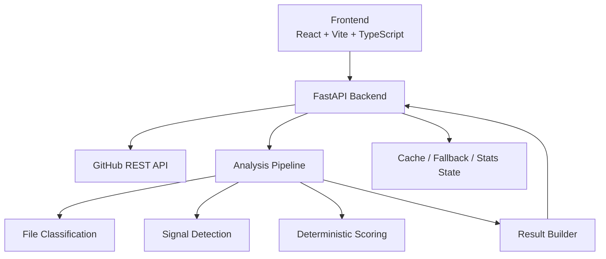
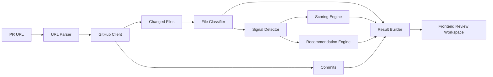

# Reviewer

<p align="center">
  
</p>

<p align="center">
  <strong>Reviewer</strong><br/>
  Deterministic PR review for public GitHub pull requests
</p>

<p align="center">
  Paste a PR URL. Reviewer fetches live GitHub data, scores merge risk with deterministic rules, and shows the files worth reviewing first.
</p>

<p align="center">
  <a href="https://github.com/shalvirajpura2/reviewer">GitHub</a>
  |
  <a href="#local-setup">Run locally</a>
</p>

## What Reviewer does

Reviewer is built for one clear job:

1. Make a review call.
2. Show what is driving that call.
3. Point the reviewer to the right files first.

Instead of producing a vague AI-style summary, Reviewer tries to feel like a real engineering tool:

- deterministic and explainable
- fast enough to use in a real workflow
- honest about what it can and cannot verify
- designed around reviewer action, not dashboard noise

## Why it feels different

Most PR review tools do one of two things poorly:

- they dump too much information and make the reviewer do the sorting
- they hide behind generic AI confidence without enough proof

Reviewer takes a different approach:

- live GitHub PR metadata, changed files, and commits
- deterministic merge scoring instead of unverifiable model confidence
- ranked review queue instead of an undirected report
- signal evidence, provenance, and limitations shown directly
- focused result page that helps a developer decide where to start

## Review flow

The backend is intentionally structured as a deterministic review pipeline.



## How it works



## What the reviewer sees

Reviewer returns a structured review experience with:

- a merge verdict
- a confidence score
- top risk signals
- the files to inspect first
- recommended next reviewer actions
- evidence and provenance
- explicit limitations when analysis is partial

## Core product ideas

### Deterministic scoring

Reviewer is not trying to sound smart. It is trying to be useful.

The score is driven by concrete signals such as:

- sensitive paths changed
- shared or high-impact code touched
- migrations and config changes
- dependency updates
- broad or large PRs
- implementation changed without nearby tests
- patch visibility gaps from GitHub

### Honest coverage

If GitHub does not return full patch hunks, if analysis is partial, or if the app is serving a fallback result, Reviewer says so directly in the output.

### Review-first UX

The frontend is built around a simple developer question:

> "What should I open first, and why?"

That is why the product emphasizes:

- check these first
- selected file context
- why attention
- recommended next step
- deeper evidence only when needed

## Architecture

### High-level system



### Analysis pipeline



## Repository layout

```text
backend/
  app/
    core/
    models/
    routes/
    services/
  requirements.txt
frontend/
  public/
  src/
    components/
    lib/
    pages/
    styles/
    types/
  package.json
  vite.config.ts
docs/
  readme/
README.md
```

## Important product files

### Frontend

- `frontend/src/pages/home_page.tsx`
- `frontend/src/pages/result_page.tsx`
- `frontend/src/components/pr_input_bar.tsx`
- `frontend/src/lib/review_mapper.ts`
- `frontend/src/styles/global.css`

### Backend

- `backend/app/routes/analyze.py`
- `backend/app/services/analysis_service.py`
- `backend/app/services/file_classifier.py`
- `backend/app/services/signal_detector.py`
- `backend/app/services/scoring_engine.py`
- `backend/app/services/recommendation_engine.py`
- `backend/app/services/result_builder.py`

## Tech stack

- Frontend: React, Vite, TypeScript, React Router
- Backend: FastAPI, Pydantic, HTTPX
- Analysis: deterministic heuristics plus patch-structure hints
- Optional signal enhancement: tree-sitter
- Testing: Pytest, Vitest

## Local setup

### 1. Install frontend dependencies

```bash
cd frontend
pnpm install
```

### 2. Configure environment

Copy `.env.example` to `.env` and set at least:

```bash
GITHUB_TOKEN=your_token_here
VITE_BACKEND_URL=http://localhost:8000
```

### 3. Run the backend

```bash
python -m venv .venv
.venv\Scripts\activate
pip install -r backend/requirements.txt
uvicorn app.main:app --app-dir backend --reload --host 0.0.0.0 --port 8000
```

### 4. Run the frontend

```bash
cd frontend
pnpm dev
```

Frontend runs on `http://localhost:5173` by default.

## Environment

### Shared

- `GITHUB_TOKEN`

### Frontend

- `VITE_BACKEND_URL`

### Backend

- `GITHUB_API_BASE`
- `BACKEND_PORT`
- `CACHE_TTL_SECONDS`
- `CORS_ALLOW_ORIGINS`

`backend/data/` is runtime-generated local state and is ignored by Git.

## Quality checks

### Backend

```bash
python -m compileall backend/app
python -m pytest backend/tests
```

### Frontend

```bash
cd frontend
pnpm test
pnpm build
```

## Current direction

Reviewer is being built as a credible developer tool:

- technical enough for engineers
- clear enough for founders and hiring managers
- fast enough for real review workflows
- honest enough to build trust over time

## Builder

Built by [Shalvi](https://shalvirajpura.xyz).
