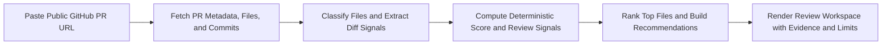
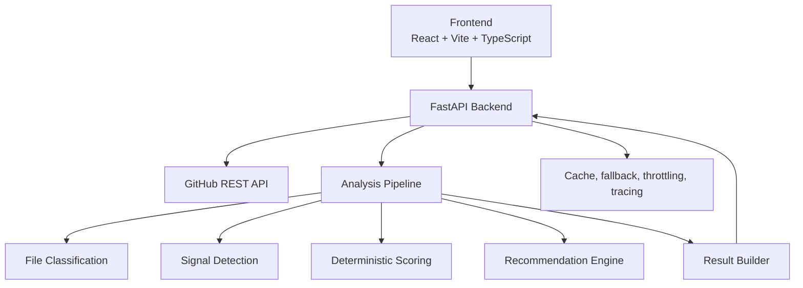
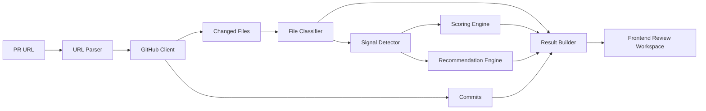

# Reviewer

<p align="center">
  
</p>

<p align="center">
  <strong>Deterministic PR review for public GitHub pull requests.</strong>
</p>

<p align="center">
  Reviewer helps developers decide where to start, what deserves attention, and how much to trust the current review surface.
</p>

<p align="center">
  
  
  
  
  
</p>

## Table of contents

- [What Reviewer is](#what-reviewer-is)
- [Why it feels different](#why-it-feels-different)
- [What the product returns](#what-the-product-returns)
- [How it works](#how-it-works)
- [Architecture](#architecture)
- [Repository layout](#repository-layout)
- [Important product files](#important-product-files)
- [Tech stack](#tech-stack)
- [Local setup](#local-setup)
- [CLI](#cli)
- [Environment](#environment)
- [Quality checks](#quality-checks)
- [Current direction](#current-direction)

## What Reviewer is

Reviewer is a product-first pull request review tool for public GitHub PRs.

Paste a PR URL and Reviewer will:

1. fetch live GitHub PR metadata, changed files, and commits
2. classify the files and detect deterministic review signals
3. score merge risk without pretending to know more than it does
4. show the files a reviewer should inspect first
5. surface evidence, provenance, and limitations clearly

The goal is not to generate fluffy AI commentary. The goal is to help a developer review a PR faster and with better focus.

## Why it feels different

Most review tools lean too hard in one of two directions:

- they dump raw information and make the reviewer do the sorting
- they produce confident language without enough evidence

Reviewer is intentionally different:

- deterministic scoring instead of opaque model confidence
- review-first UX instead of dashboard-first UX
- explicit limitations when the analysis is partial
- ranked files and review notes instead of generic summaries
- backend truth shown directly in the frontend

## What the product returns

Reviewer is designed to answer the practical questions a developer actually has:

- what is the review call
- what is driving that call
- which files should be opened first
- what should be verified next
- how trustworthy is this result

The result page is built around:

- decision
- why attention
- check these first
- selected file context
- recommended next step
- deeper evidence only when needed

## How it works



## Architecture

### High-level system



### Analysis pipeline



## Repository layout

```text
backend/
  app/
    core/
    models/
    routes/
    services/
  tests/
frontend/
  public/
  src/
    components/
    lib/
    pages/
    styles/
    types/
docs/
  readme/
README.md
```

## Important product files

### Frontend

- `frontend/src/pages/home_page.tsx`
- `frontend/src/pages/result_page.tsx`
- `frontend/src/components/pr_input_bar.tsx`
- `frontend/src/lib/review_mapper.ts`
- `frontend/src/styles/global.css`

### Backend

- `backend/app/routes/analyze.py`
- `backend/app/services/analysis_service.py`
- `backend/app/services/file_classifier.py`
- `backend/app/services/signal_detector.py`
- `backend/app/services/scoring_engine.py`
- `backend/app/services/recommendation_engine.py`
- `backend/app/services/result_builder.py`

## Tech stack

- Frontend: React, Vite, TypeScript, React Router
- Backend: FastAPI, Pydantic, HTTPX
- Analysis: deterministic heuristics plus patch-structure hints
- Runtime hardening: caching, fallback storage, throttling, request tracing
- Testing: Pytest, Vitest

## Local setup

### 1. Install frontend dependencies

```bash
cd frontend
pnpm install
```

### 2. Configure environment

Copy `.env.example` to `.env` and set at least:

```bash
GITHUB_CLIENT_ID=your_client_id_here
VITE_BACKEND_URL=http://localhost:8000
```

### 3. Run the backend

```bash
python -m venv .venv
.venv\Scripts\activate
pip install -r backend/requirements.txt
uvicorn app.main:app --app-dir backend --reload --host 0.0.0.0 --port 8000
```

### 4. Run the frontend

```bash
cd frontend
pnpm dev
```

Frontend runs on `http://localhost:5173` by default.
### 5. Build the backend image

Use the repository root as the Docker build context:

```bash
docker build -f backend/Dockerfile -t reviewer-backend backend
```

## CLI

Install the published CLI with `pipx` for the cleanest global command setup:

```bash
pipx install reviewer-cli
```

You can also install it with `pip`:

```bash
pip install reviewer-cli
```

For local development in this repository:

```bash
pip install -e backend
```

Preferred setup uses GitHub device login with `GITHUB_CLIENT_ID` configured in your environment.

Then run Reviewer directly from your terminal:

```bash
reviewer login
reviewer whoami
reviewer analyze https://github.com/owner/repo/pull/123
reviewer publish-summary https://github.com/owner/repo/pull/123
reviewer logout
```

The CLI now guides users step by step during login, reuses the saved GitHub session automatically, and renders reports in readable sections so the next action is clear. `GITHUB_TOKEN` is still supported as an advanced fallback.

Set `REVIEWER_BACKEND_API_BASE` to let the CLI hand off `publish-summary` to your hosted Reviewer backend, and set `REVIEWER_PUBLISH_GITHUB_TOKEN` on that backend if you want PR comments to be posted with a server-owned GitHub identity.

## Environment

### Shared

- `GITHUB_CLIENT_ID`
- `GITHUB_TOKEN`
- `REVIEWER_BACKEND_API_BASE`

### Frontend

- `VITE_BACKEND_URL`

### Backend

- `GITHUB_API_BASE`
- `REVIEWER_CONFIG_DIR`
- `BACKEND_PORT`
- `REVIEWER_PUBLISH_GITHUB_TOKEN`
- `CACHE_TTL_SECONDS`
- `CORS_ALLOW_ORIGINS`
- `CORS_ALLOW_ORIGIN_REGEX`
- `LOG_LEVEL`

`backend/data/` is runtime-generated local state and is ignored by Git.

## Quality checks

### Backend

```bash
python -m compileall backend/app
python -m pytest backend/tests
```

### Frontend

```bash
cd frontend
pnpm test
pnpm build
```

## Current direction

Reviewer is being built to feel credible the moment a developer opens it:

- fast enough to use in a real review workflow
- direct enough to be useful in under a minute
- transparent enough to earn trust
- polished enough to represent the product well to developers, founders, and hiring teams

## Builder

Built by [Shalvi](https://shalvirajpura.xyz).
